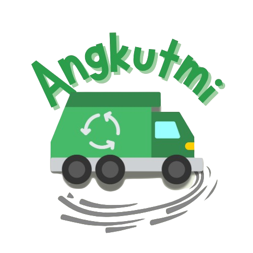

<p align="center">
  
</p>

# Angkutmi
Proyek Akhir Semester 3: Aplikasi Mobile yang Menyediakan Layanan Pengangkutan Sampah.

Aplikasi ini diberi nama "Angkutmi", yang berarti memudahkan dan memastikan pengangkutan sampah secara andal. Aplikasi ini dibuat dengan memperhatikan dua tujuan SDG, yaitu aksi iklim (climate action) dan energi bersih dan terjangkau (affordable and clean energy).  

Bagian front-end dikembangkan menggunakan Flutter, sedangkan back-end dikembangkan menggunakan Laravel 11.

# Contributors
1. Hainzel (Team Lead, Back-end)
2. Andrey (Front-end)
3. Aryo (Front-end)
4. Ivone (UI/UX, Back-end)

### About Project
- Collaboration Platform: [Miro](https://miro.com/app/board/uXjVLFhVRow=/?share_link_id=7465868604)
- Presentation: [Canva Slides](https://www.canva.com/design/DAGc0Auv6Xg/vOSq1if2M2HASWHyMVqwtw/view)

# List Fitur Utama
1. Pengangkutan instan
2. Pengangkutan berkala berupa subskripsi
3. Insentif reward berupa voucher dan gacha

# Instalasi
## Setup Project
> [!NOTE] Prasyarat
> Pastikan untuk menginstal semua program yang diperlukan untuk framework Flutter agar lingkungan pengembangan Flutter dapat disiapkan dengan benar. (flutter doctor)

1. Masuk ke dalam directory yang ingin yang dijadikan tempat project 
```
cd path/ke/direktori/anda
```
2. Lalu clone repository ini dengan menggunakan command berikut
```
git clone https://github.com/liwangivone/Angkutmi.git
```
3. Jika download zip, *extract* zip tersebut ke dalam workspace yang anda inginkan.

4. Masuk ke dalam *IDE (Integrated Development Environment)* yang anda inginkan (direkomendasikan menggunakan *Visual Studio Code*) dan open folder yang sudah anda *clone/extract.*

> [!IMPORTANT] Penting
> Sebelum memulai project dan menyambungkan dengan back-end, pastikan untuk menentukan *device* yang ingin digunakan untuk debug aplikasi. Untuk informasi lebih detail, cek "Angkutmi-Frontend\lib\url.dart"

### Menyalakan Back-end
Navigasi ke folder "Angkutmi-Backend" menggunakan terminal dan masukkan command berikut secara berurutan:
```
composer install
```
```
php artisan migrate
```
```
php artisan seed
```
```
php artisan ser
```
*\*cek Angkutmi-Frontend\lib\url.dart untuk mengganti IP dan port.*

### Memulai Debug
1. Navigasi ke folder "Angkutmi-Frontend", nyalakan terminal dan install dependensi yang dibutuhkan:
```
flutter pub get
```
2. Tekan **F5** untuk memulai debugging (atau flutter run di terminal)
```
flutter run
```
